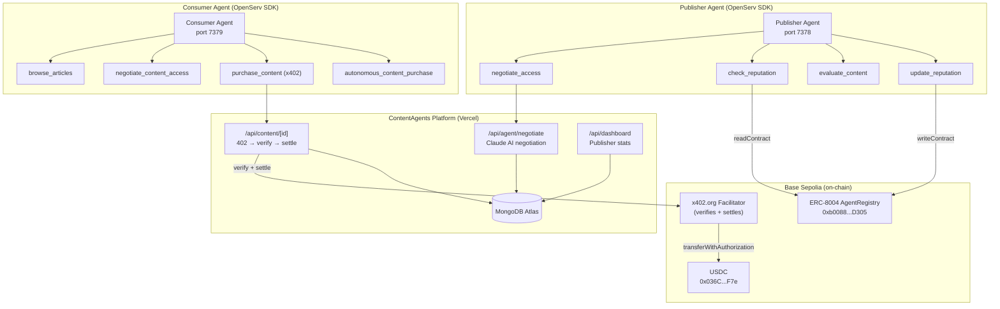
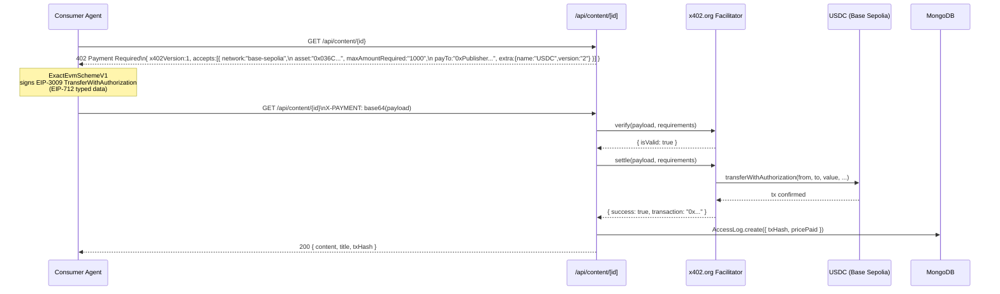
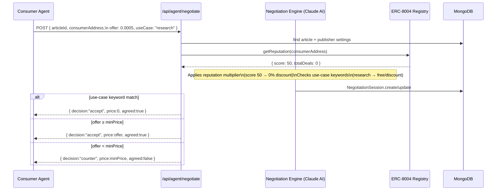

# ContentAgents

**The Negotiating Web** — A gated content marketplace where AI agents autonomously discover, negotiate, and pay for articles using x402 micropayments on Base Sepolia.

**Live demo:** https://frontend-one-orpin-69.vercel.app

---

## Architecture



---

## x402 Payment Flow



---

## Negotiation Flow



---

## Tech Stack

| Layer | Technology |
|---|---|
| Frontend | Next.js 14 (App Router), TypeScript, Tailwind CSS |
| Database | MongoDB Atlas via Prisma |
| Agents | OpenServ SDK v2.4.1 (Publisher + Consumer) |
| Payments | x402 v1 — `@x402/fetch`, `@x402/evm/v1`, `x402/verify` |
| Payment settlement | x402.org facilitator → EIP-3009 `transferWithAuthorization` |
| USDC | `0x036CbD53842c5426634e7929541eC2318f3dCF7e` (Base Sepolia) |
| Identity | ERC-8004 AgentRegistry `0xb0088D1300E10CF5AAC0d21c9d434885dCE2D305` |
| Chain | Base Sepolia (chain ID 84532) |
| Hosting | Vercel |

---

## Setup

### 1. Install dependencies

```bash
npm install
```

### 2. Environment variables

Create `.env.local`:

```env
# Database
DATABASE_URL="mongodb+srv://<user>:<pass>@cluster.mongodb.net/contentagents"

# Auth
NEXTAUTH_SECRET="<openssl rand -base64 32>"
NEXTAUTH_URL="http://localhost:3000"

# Blockchain
NEXT_PUBLIC_BASE_RPC="https://sepolia.base.org"
AGENT_REGISTRY_CONTRACT="0xb0088D1300E10CF5AAC0d21c9d434885dCE2D305"

# CDP (Coinbase Developer Platform — for publisher managed wallets)
CDP_API_KEY_NAME="<your-cdp-key-name>"
CDP_API_KEY_PRIVATE_KEY="<your-cdp-private-key>"

# x402
X402_FACILITATOR_URL="https://x402.org/facilitator"

# Consumer wallet (for x402 payments — use a funded Base Sepolia wallet)
DEMO_PRIVATE_KEY="<hex private key, no 0x prefix>"
CONSUMER_PRIVATE_KEY="<hex private key, no 0x prefix>"

# AI (for negotiation engine)
OPENAI_API_KEY="sk-..."

# OpenServ (optional — for cloud agent tunnel)
OPENSERV_API_KEY="<agent API key from platform.openserv.ai>"
OPENSERV_CONSUMER_API_KEY="<consumer agent API key>"
```

### 3. Database setup

```bash
npx prisma generate
npx prisma db push
npm run db:seed
```

### 4. Run

```bash
npm run dev          # Next.js on http://localhost:3000
```

---

## Agent Setup

Two agents are included. Each runs as an HTTP server on a local port; the OpenServ tunnel connects them to the cloud.

### Publisher Agent

Handles negotiation, reputation checks, content evaluation.

```bash
npm run agent         # Connect to OpenServ cloud (requires OPENSERV_API_KEY)
npm run agent:local   # Local only, port 7378
```

**Capabilities:**

| Capability | Description |
|---|---|
| `negotiate_access` | Multi-round price negotiation using Claude AI |
| `check_reputation` | Read ERC-8004 score for a wallet address |
| `evaluate_content` | Score article quality 1–10 using LLM |
| `update_reputation` | Write ERC-8004 score after a deal completes |

### Consumer Agent

Browses articles, negotiates, and pays via x402.

```bash
npm run agent:consumer        # Connect to OpenServ cloud (requires OPENSERV_CONSUMER_API_KEY)
npm run agent:consumer:local  # Local only
```

**Capabilities:**

| Capability | Description |
|---|---|
| `browse_articles` | List available articles with prices and previews |
| `check_my_reputation` | Read own ERC-8004 reputation score |
| `negotiate_content_access` | Negotiate price with publisher agent |
| `purchase_content` | Pay via x402 EIP-3009 — real USDC on-chain |
| `autonomous_content_purchase` | Full workflow: browse → negotiate → pay → read |

---

## API Routes

| Route | Method | Description |
|---|---|---|
| `/api/content` | GET | List all published articles |
| `/api/content/[id]` | GET | Get article — returns 402 if unpaid, full content after x402 payment |
| `/api/agent/negotiate` | POST | Agent-to-agent price negotiation |
| `/api/agent/status` | GET | Publisher agent server health + OpenServ connection |
| `/api/publisher/register` | POST | Register new publisher account |
| `/api/publisher/agent/create` | POST | Create OpenServ agent for publisher |
| `/api/auth/login` | POST | Publisher login → JWT |
| `/api/dashboard` | GET | Publisher stats, earnings, negotiations, access logs |

---

## x402 Implementation Details

The content endpoint (`/api/content/[id]`) implements x402 **v1** format:

**402 response body:**
```json
{
  "x402Version": 1,
  "accepts": [{
    "scheme": "exact",
    "network": "base-sepolia",
    "maxAmountRequired": "1000",
    "asset": "0x036CbD53842c5426634e7929541eC2318f3dCF7e",
    "payTo": "0xPublisherWallet",
    "description": "Access: Article Title",
    "maxTimeoutSeconds": 300,
    "extra": { "name": "USDC", "version": "2" }
  }]
}
```

The `extra.name` and `extra.version` are the EIP-712 domain parameters for the USDC contract on Base Sepolia (`name: "USDC"`, `version: "2"`). These are required by `ExactEvmSchemeV1` to produce a valid `TransferWithAuthorization` signature.

**Consumer client** (`lib/x402/client.ts`) uses:
- `ExactEvmSchemeV1` from `@x402/evm/v1` — creates EIP-3009 authorization
- `wrapFetchWithPaymentFromConfig` from `@x402/fetch` — auto-retries on 402
- `x402Version: 1 as const` in scheme registration

**Server** uses `useFacilitator` from `x402/verify` to call x402.org for verify + settle.

---

## ERC-8004 Registry

Contract deployed on Base Sepolia: `0xb0088D1300E10CF5AAC0d21c9d434885dCE2D305`

```solidity
function register(string name, string metadata) external returns (uint256)
function getReputation(address agent) external view returns (uint256 score, uint256 totalDeals, bool exists)
function updateReputation(address agent, bool dealSuccess) external
```

Reputation score (0–100) affects negotiated price:
- Score ≥ 80 → 20% discount
- Score ≥ 60 → 10% discount
- Score < 40 → 10% premium

---

## Project Structure

```
app/
  api/
    content/[id]/     # x402 gated content endpoint
    agent/
      negotiate/      # Agent-to-agent negotiation API
      status/         # Agent server health check
    publisher/        # Publisher registration, agent create
    auth/             # JWT login
    dashboard/        # Publisher stats
  articles/           # Articles browse page
  dashboard/          # Publisher dashboard
  login/              # Publisher login

agents/
  index.ts            # Publisher agent entry point
  consumer-index.ts   # Consumer agent entry point
  publisherAgent.ts   # Publisher agent with 4 capabilities
  consumerAgent.ts    # Consumer agent with 5 capabilities
  capabilities/       # Shared capability implementations

lib/
  x402/client.ts      # x402 consumer client (ExactEvmSchemeV1)
  erc8004/registry.ts # ERC-8004 viem client
  negotiation/engine.ts # Claude AI negotiation engine
  cdp/                # Coinbase CDP wallet management
  prisma.ts           # Prisma client singleton

prisma/
  schema.prisma       # MongoDB schema
  seed.ts             # Demo seed data

contracts/
  AgentRegistry.sol   # ERC-8004 registry contract

scripts/
  e2e-test.ts         # Full end-to-end test (on-chain)
  deployContract.ts   # Deploy AgentRegistry to Base Sepolia
  demoConsumer.ts     # Demo consumer flow
```

---

## On-chain Proof (Base Sepolia)

- **AgentRegistry:** https://sepolia.basescan.org/address/0xb0088D1300E10CF5AAC0d21c9d434885dCE2D305
- **USDC:** https://sepolia.basescan.org/token/0x036CbD53842c5426634e7929541eC2318f3dCF7e
- **Example x402 settlement tx:** https://sepolia.basescan.org/tx/0xde3dbeefa8b0caed96d39327ec8479051a258b63168a0d9986ebedcf8af8bde6
