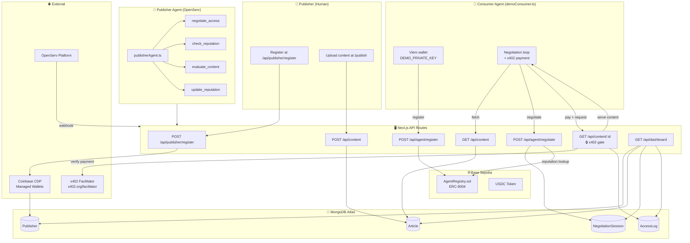
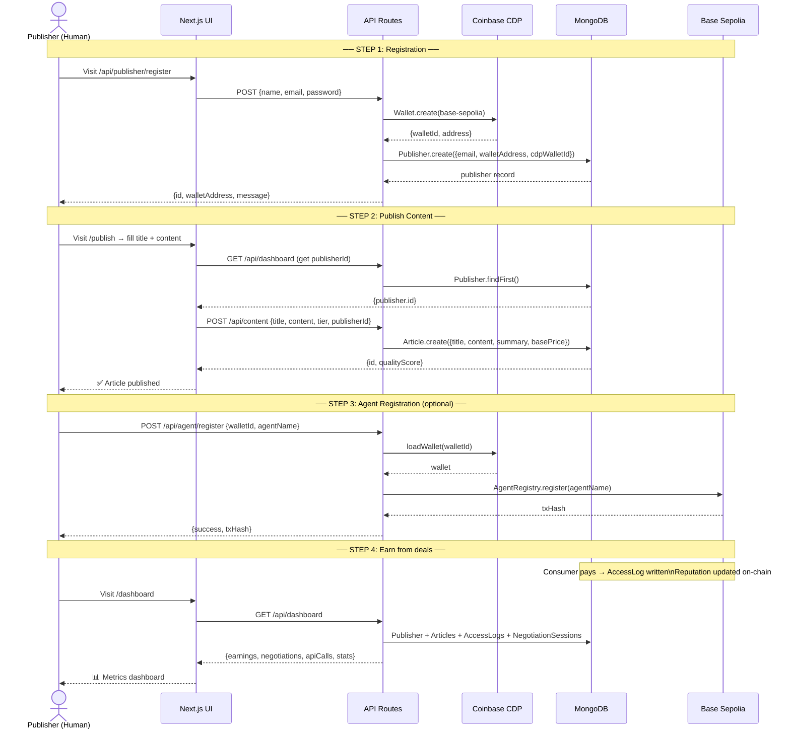
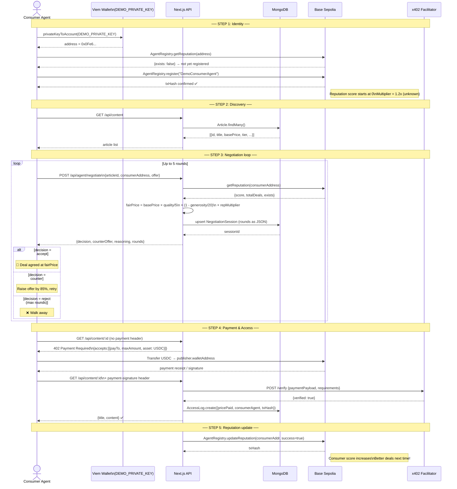
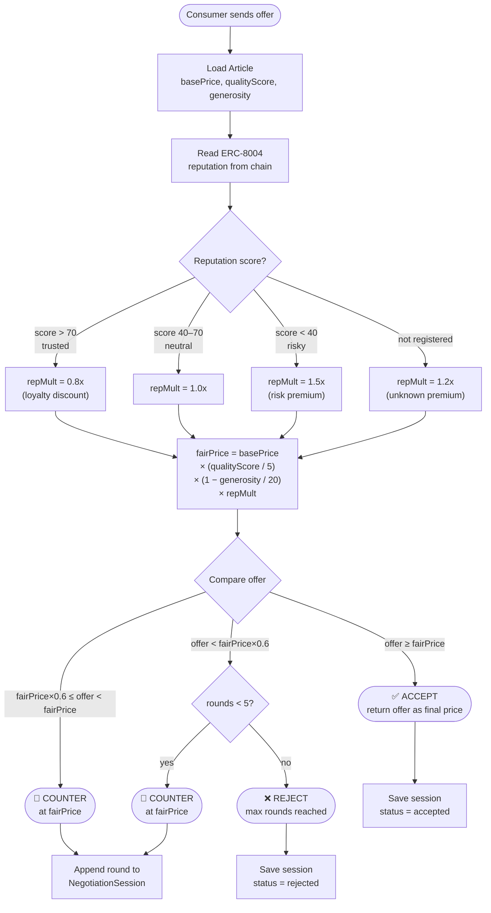
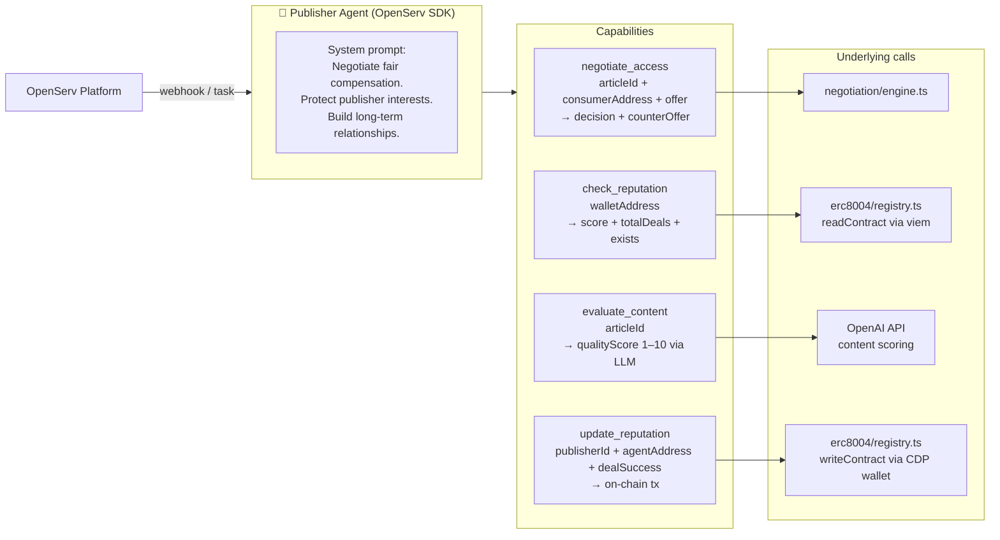
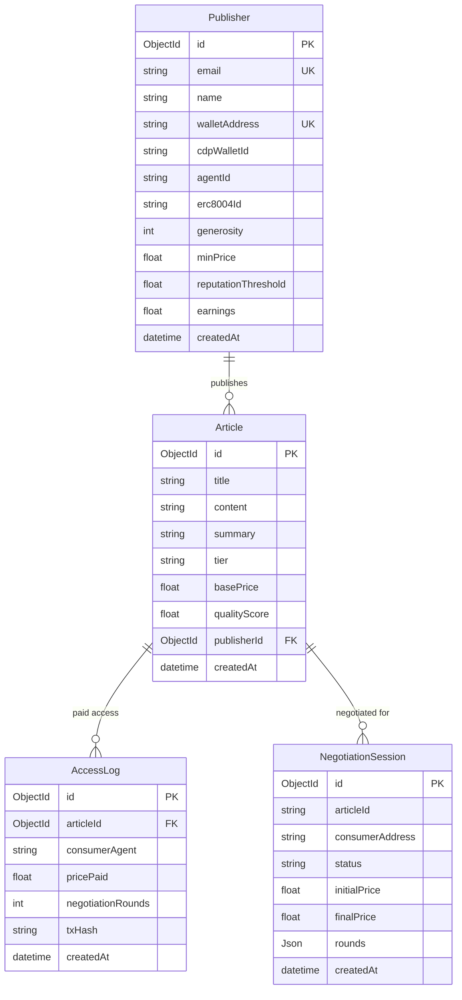
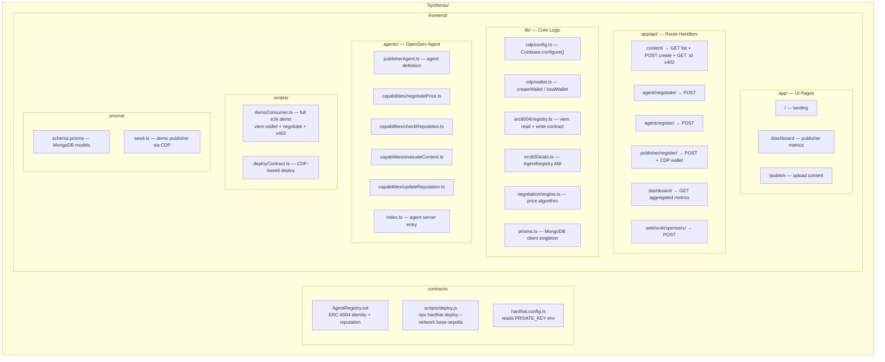

# ContentAgents — System Workflow

ContentAgents is an AI-native content marketplace where **publisher agents** and **consumer agents** negotiate access to premium articles autonomously using on-chain identity (ERC-8004), x402 micropayments, and CDP-managed wallets on Base Sepolia.

---

## 1. Full System Architecture



---

## 2. Publisher Journey (from zero to earning)



---

## 3. Consumer Journey (negotiate → pay → read)



---

## 4. Negotiation Algorithm



---

## 5. Publisher Agent Capabilities (OpenServ)



---

## 6. Data Model



---

## 7. Component Map



---

## 8. Environment Variables

| Variable | Used by | Purpose |
|---|---|---|
| `CDP_API_KEY_NAME` | `lib/cdp/config.ts` | Coinbase CDP API key ID |
| `CDP_API_KEY_PRIVATE_KEY` | `lib/cdp/config.ts` | CDP API secret (base64 Ed25519) |
| `CDP_WALLET_SECRET` | `@coinbase/cdp-sdk` v1 | Wallet encryption secret (CDP Portal → Settings → Wallet Secrets) |
| `DEMO_PRIVATE_KEY` | `scripts/demoConsumer.ts` | Funded Base Sepolia key for demo consumer wallet |
| `OPENAI_API_KEY` | `agents/capabilities/evaluateContent.ts` | Content quality scoring |
| `OPENSERV_API_KEY` | `agents/publisherAgent.ts` | OpenServ agent platform |
| `AGENT_REGISTRY_CONTRACT` | `lib/erc8004/registry.ts` | Deployed contract address on Base Sepolia |
| `X402_FACILITATOR_URL` | `app/api/content/[id]/route.ts` | Payment verification endpoint |
| `DATABASE_URL` | `lib/prisma.ts` | MongoDB Atlas connection string |
| `NEXT_PUBLIC_BASE_RPC` | `lib/erc8004/registry.ts` | Base Sepolia RPC URL |
| `NEXTAUTH_SECRET` | NextAuth | Session signing secret |
| `NEXTAUTH_URL` | NextAuth | App base URL |

---

## 9. Run Commands

```bash
# ── Contracts ──────────────────────────────────────
cd contracts
PRIVATE_KEY=<funded_key> npm run deploy   # deploy to Base Sepolia

# ── Frontend setup ─────────────────────────────────
cd frontend
npm install
cp .env.local.example .env.local          # fill in credentials
npx prisma generate                        # generate MongoDB client
npx prisma db push                         # create collections + indexes
npm run db:seed                            # seed demo publisher (needs CDP)

# ── Run ────────────────────────────────────────────
npm run dev                                # start dev server → http://localhost:3000
npm run demo                               # run full consumer demo (uses DEMO_PRIVATE_KEY)
npm run agent                              # start OpenServ publisher agent server
npm run build                              # production build

# ── Utilities ──────────────────────────────────────
npx tsc --noEmit                           # type check
npx prisma studio                          # MongoDB GUI browser
```
