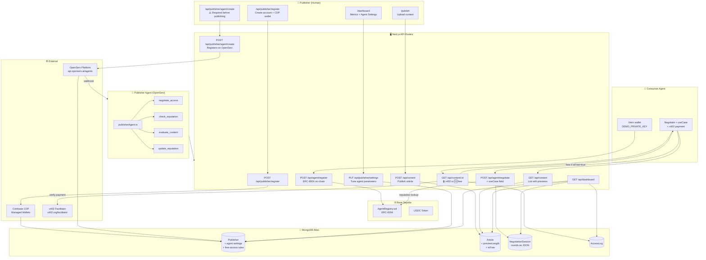
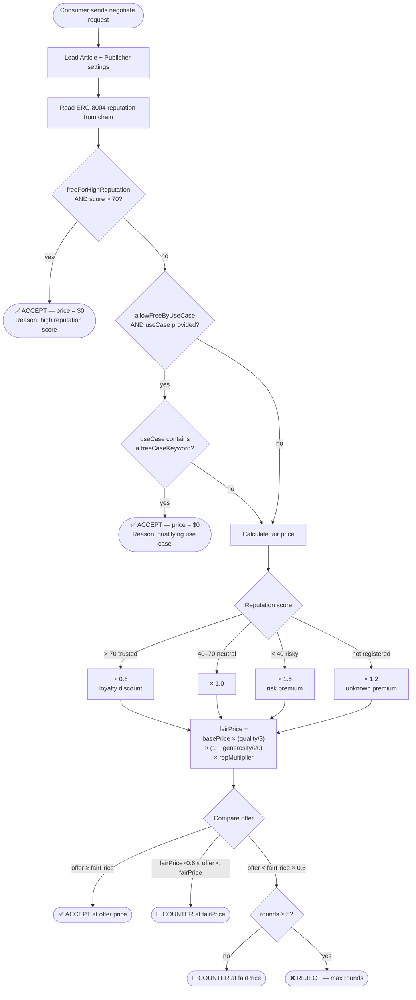
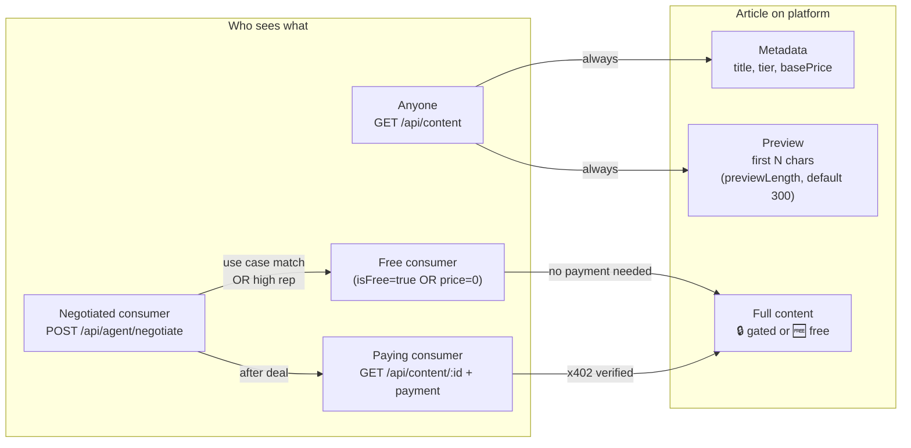
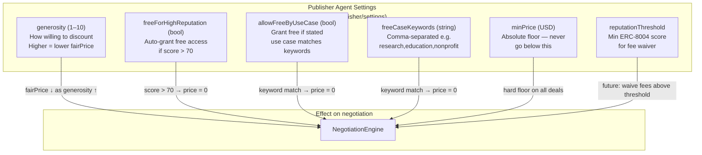
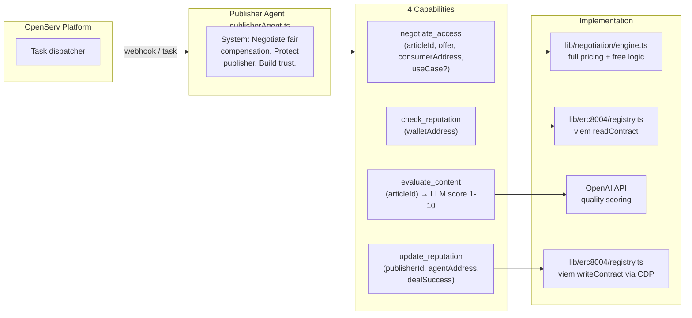
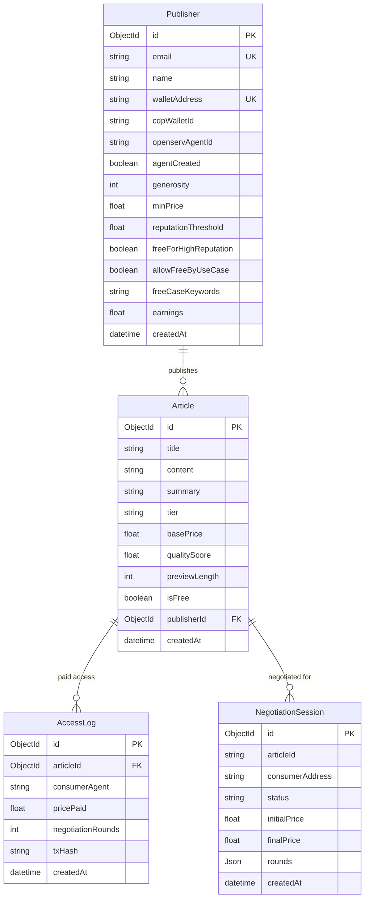
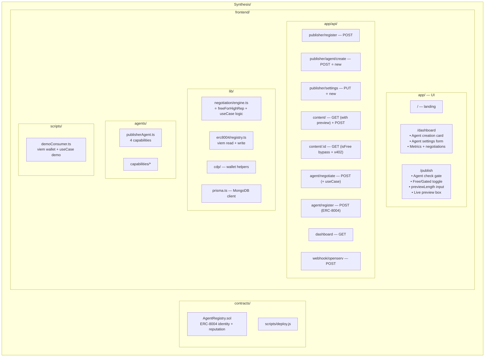
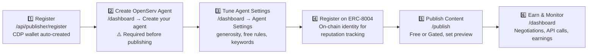

# ContentAgents — System Workflow

ContentAgents is an AI-native content marketplace where **publisher agents** and **consumer agents** negotiate access to premium articles autonomously using on-chain identity (ERC-8004), x402 micropayments, and CDP-managed wallets on Base Sepolia.

---

## 1. Full System Architecture



---

## 2. Publisher Journey — Full Flow

```mermaid
sequenceDiagram
    actor P as Publisher (Human)
    participant UI as Next.js UI
    participant API as API Routes
    participant CDP as Coinbase CDP
    participant OS as OpenServ
    participant DB as MongoDB
    participant Chain as Base Sepolia

    rect rgb(20, 30, 50)
        Note over P,Chain: STEP 1 — Register
        P->>UI: POST /api/publisher/register\n{name, email, password?}
        UI->>API: request
        API->>CDP: Wallet.create(base-sepolia)
        CDP-->>API: {walletId, address}
        API->>DB: Publisher.create({email, walletAddress,\ncdpWalletId, agentCreated=false})
        API-->>P: {id, walletAddress} ✅
    end

    rect rgb(20, 40, 30)
        Note over P,Chain: STEP 2 — Create OpenServ Agent (mandatory)
        Note over UI: /dashboard shows amber warning\n"Create your agent before publishing"
        P->>UI: Click "Create your agent"
        UI->>API: POST /api/publisher/agent/create
        API->>OS: POST https://api.openserv.ai/agents\n{name, walletAddress}
        OS-->>API: {id: "openserv-agent-xxx"}
        API->>DB: Publisher.update({agentCreated=true,\nopenservAgentId})
        API-->>UI: {openservAgentId} ✅
        Note over UI: Banner turns green — publish form unlocked
    end

    rect rgb(30, 20, 50)
        Note over P,Chain: STEP 3 — Tune Agent Settings
        P->>UI: Open Agent Settings on /dashboard
        Note over UI: generosity, minPrice, reputationThreshold,\nfreeForHighReputation, allowFreeByUseCase,\nfreeCaseKeywords
        P->>UI: Adjust sliders / toggles → Save
        UI->>API: PUT /api/publisher/settings\n{generosity, minPrice, ...}
        API->>DB: Publisher.update(settings)
        API-->>UI: updated settings ✅
    end

    rect rgb(40, 25, 20)
        Note over P,Chain: STEP 4 — Register on ERC-8004 (optional but recommended)
        P->>API: POST /api/agent/register\n{walletId, agentName}
        API->>CDP: loadWallet(walletId)
        CDP-->>API: wallet
        API->>Chain: AgentRegistry.register(agentName)
        Chain-->>API: txHash
        API-->>P: {success, txHash} ✅
    end

    rect rgb(20, 35, 45)
        Note over P,Chain: STEP 5 — Publish Content
        Note over UI: Only available if agentCreated = true
        P->>UI: Fill title, content, tier\nToggle: Free 🆓 or Gated 🔒\nSet preview length (default 300 chars)
        UI->>API: GET /api/dashboard (get publisherId)
        UI->>API: POST /api/content\n{title, content, tier, publisherId,\nisFree, previewLength}
        API->>DB: Article.create({...isFree, previewLength,\nsummary=content.slice(0,120)})
        API-->>UI: {id, qualityScore} ✅
    end

    rect rgb(15, 40, 40)
        Note over P,Chain: STEP 6 — Monitor on Dashboard
        P->>UI: Visit /dashboard
        UI->>API: GET /api/dashboard
        API->>DB: Publisher + Articles + AccessLogs\n+ NegotiationSessions
        API-->>UI: {earnings, negotiations,\napiCalls, stats, reputation}
        Note over UI: See agent creation status, live metrics,\naccepted deals, paid accesses
    end
```



---

## 3. Consumer Journey — Negotiate → Pay → Read

```mermaid
sequenceDiagram
    actor C as Consumer Agent
    participant W as Viem Wallet
    participant API as Next.js API
    participant DB as MongoDB
    participant Chain as Base Sepolia
    participant X402 as x402 Facilitator

    rect rgb(20, 30, 50)
        Note over C,X402: STEP 1 — Identity Setup
        C->>W: privateKeyToAccount(DEMO_PRIVATE_KEY)
        W-->>C: address = 0x0Fe6...
        C->>Chain: AgentRegistry.getReputation(address)
        Chain-->>C: {exists: false}
        C->>Chain: AgentRegistry.register("DemoConsumerAgent")
        Chain-->>C: txHash confirmed ✅
        Note right of Chain: Score starts at 0\nMultiplier = 1.2× (unknown)
    end

    rect rgb(20, 40, 30)
        Note over C,X402: STEP 2 — Discover Content
        C->>API: GET /api/content
        API->>DB: Article.findMany()
        DB-->>API: [{id, title, tier, basePrice,\npreview (first N chars), isFree}]
        API-->>C: article list with free previews
    end

    rect rgb(40, 25, 20)
        Note over C,X402: STEP 3 — Negotiate (smart routing)
        C->>API: POST /api/agent/negotiate\n{articleId, consumerAddress,\noffer, useCase?}

        API->>Chain: getReputation(consumerAddress)
        Chain-->>API: {score, totalDeals, exists}

        alt publisher.freeForHighReputation AND score > 70
            API-->>C: {decision: accept, price: 0,\nreasoning: "Free — high reputation"}
        else publisher.allowFreeByUseCase AND useCase matches keywords
            Note over API: keywords: research, education,\nnonprofit, open-source, ...
            API-->>C: {decision: accept, price: 0,\nreasoning: "Free — qualifying use case"}
        else normal negotiation
            API->>API: fairPrice = basePrice\n  × (qualityScore/5)\n  × (1 − generosity/20)\n  × repMultiplier
            API->>DB: upsert NegotiationSession
            API-->>C: {decision, counterOffer, reasoning}
        end

        loop counter → raise offer 85% each round (max 5)
            C->>API: POST /api/agent/negotiate\n{sessionId, higher offer}
            API-->>C: counter or accept
        end
    end

    rect rgb(30, 20, 50)
        Note over C,X402: STEP 4 — Access Content
        alt article.isFree = true
            C->>API: GET /api/content/:id
            API-->>C: {title, content} ✅ no payment needed
        else price = 0 (free from negotiation)
            C->>API: GET /api/content/:id\n+ x-agreed-price: 0
            API-->>C: {title, content} ✅
        else paid access
            C->>API: GET /api/content/:id (no header)
            API-->>C: 402 Payment Required\n{accepts:[{payTo, amount USDC, network}]}
            C->>Chain: transfer USDC → publisher.walletAddress
            Chain-->>C: payment receipt
            C->>API: GET /api/content/:id\n+ payment-signature header
            API->>X402: POST /verify {paymentPayload}
            X402-->>API: {verified: true}
            API->>DB: AccessLog.create({pricePaid, txHash})
            API-->>C: {title, content} ✅
        end
    end

    rect rgb(15, 40, 40)
        Note over C,X402: STEP 5 — Reputation Update
        API->>Chain: AgentRegistry.updateReputation\n(consumerAddr, dealSuccess=true)
        Chain-->>API: txHash
        Note right of Chain: Score increases → better\ndeals / free access next time
    end
```



---

## 4. Negotiation Decision Tree



---

## 5. Content Visibility Model



---

## 6. Agent Settings Reference



---

## 7. OpenServ Agent Capabilities



---

## 8. Data Model



---

## 9. Component Map



---

## 10. Environment Variables

| Variable | Used by | Purpose |
|---|---|---|
| `CDP_API_KEY_NAME` | `lib/cdp/config.ts` | Coinbase CDP API key ID |
| `CDP_API_KEY_PRIVATE_KEY` | `lib/cdp/config.ts` | CDP API secret (base64 Ed25519) |
| `CDP_WALLET_SECRET` | `@coinbase/cdp-sdk` v1 | Wallet encryption secret (CDP Portal → Settings → Wallet Secrets) |
| `DEMO_PRIVATE_KEY` | `scripts/demoConsumer.ts` | Funded Base Sepolia key for demo consumer wallet |
| `OPENAI_API_KEY` | `agents/capabilities/evaluateContent.ts` | Content quality scoring via LLM |
| `OPENSERV_API_KEY` | `app/api/publisher/agent/create` | Register publisher agent on OpenServ |
| `AGENT_REGISTRY_CONTRACT` | `lib/erc8004/registry.ts` | Deployed AgentRegistry address on Base Sepolia |
| `X402_FACILITATOR_URL` | `app/api/content/[id]/route.ts` | Payment verification endpoint |
| `DATABASE_URL` | `lib/prisma.ts` | MongoDB Atlas connection string |
| `NEXT_PUBLIC_BASE_RPC` | `lib/erc8004/registry.ts` | Base Sepolia RPC URL |
| `NEXTAUTH_SECRET` | NextAuth | Session signing secret |
| `NEXTAUTH_URL` | NextAuth | App base URL (`http://localhost:3000`) |

---

## 11. Run Commands

```bash
# ── Contracts ──────────────────────────────────────────────────
cd contracts
PRIVATE_KEY=<funded_key> npm run deploy    # deploy AgentRegistry to Base Sepolia

# ── Frontend setup ─────────────────────────────────────────────
cd frontend
npm install
cp .env.local.example .env.local           # fill in all credentials
npx prisma generate                         # generate MongoDB Prisma client
npx prisma db push                          # create collections + indexes in MongoDB
npm run db:seed                             # seed demo publisher (needs CDP)

# ── Dev ────────────────────────────────────────────────────────
npm run dev                                 # → http://localhost:3000
npm run demo                                # run full consumer demo (uses DEMO_PRIVATE_KEY)
npm run agent                               # start OpenServ publisher agent server

# ── Quality ────────────────────────────────────────────────────
npx tsc --noEmit                            # type check (0 errors)
npm run build                               # production build
npx prisma studio                           # MongoDB GUI in browser
```

---

## 12. Publisher Onboarding Checklist


