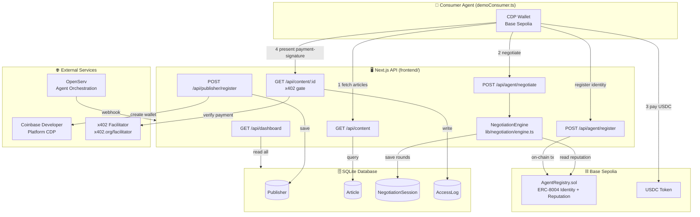
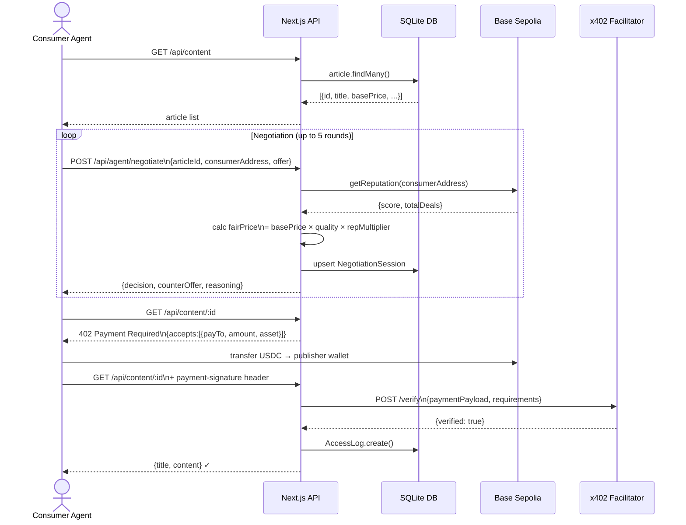
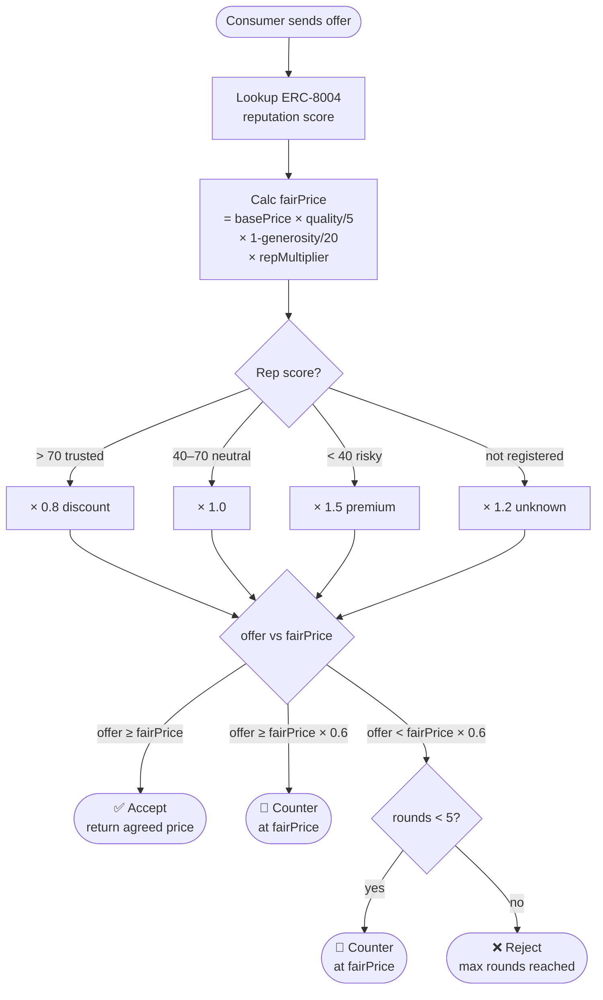
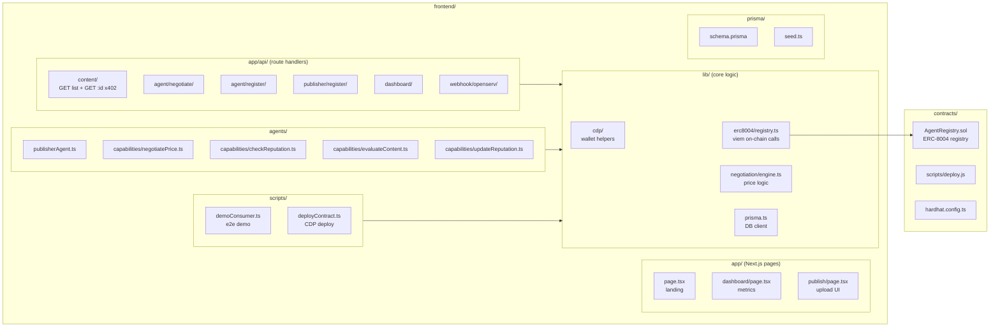
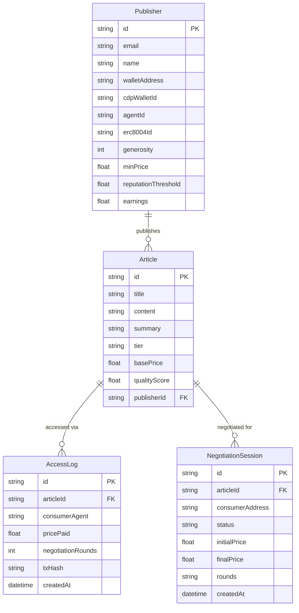

# ContentAgents — System Workflow

ContentAgents is an AI-native content marketplace where **publisher agents** and **consumer agents** negotiate access to premium articles autonomously using on-chain identity (ERC-8004), x402 micropayments, and CDP-managed wallets on Base Sepolia.

---

## High-Level Architecture



---

## End-to-End Request Flow



---

## Negotiation Algorithm



---

## Component Map



---

## Data Model



---

## Key Environment Variables

| Variable | Purpose |
|---|---|
| `CDP_API_KEY_NAME` | Coinbase Developer Platform API key ID |
| `CDP_API_KEY_PRIVATE_KEY` | CDP API secret for managed wallet signing |
| `OPENAI_API_KEY` | OpenAI for content quality scoring |
| `OPENSERV_API_KEY` | OpenServ agent orchestration |
| `AGENT_REGISTRY_CONTRACT` | Deployed ERC-8004 contract on Base Sepolia |
| `X402_FACILITATOR_URL` | x402 payment verifier endpoint |
| `DATABASE_URL` | SQLite file path (`file:./dev.db`) |
| `NEXT_PUBLIC_BASE_RPC` | Base Sepolia RPC URL |

---

## Run Commands

```bash
# Start dev server
cd frontend && npm run dev

# Run end-to-end demo
cd frontend && npm run demo

# Deploy contract (Hardhat)
cd contracts && PRIVATE_KEY=<key> npm run deploy

# Seed database
cd frontend && npm run db:seed

# Type check
cd frontend && npx tsc --noEmit

# Production build
cd frontend && npm run build
```
